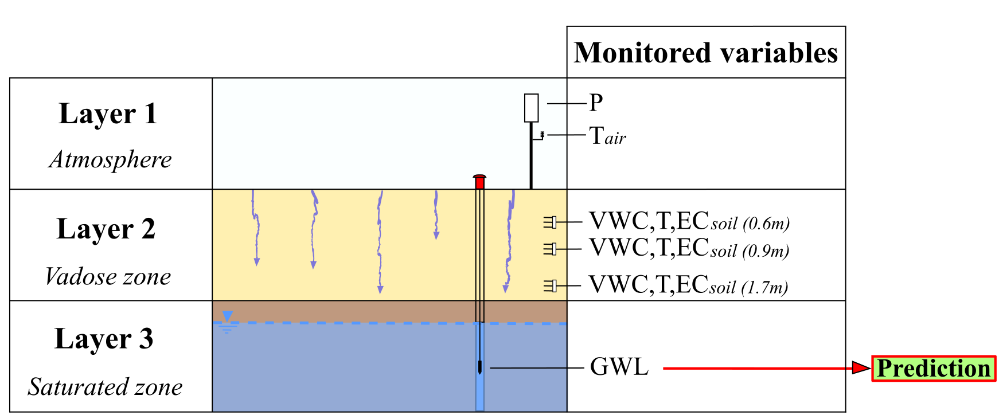
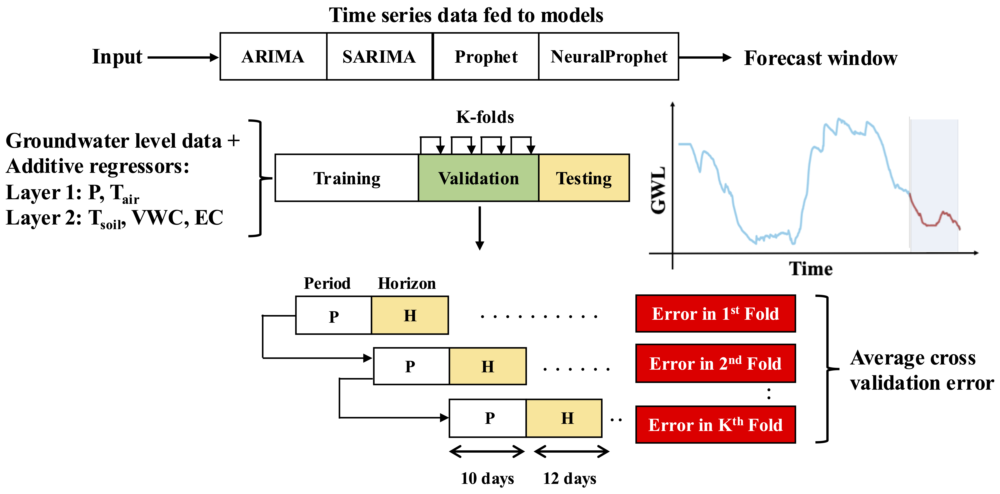

</br></br></br></br>
<h1> Groundwater level forecasting using data driven models and vadose zone: A comparative analysis of ARIMA, SARIMAX, Prophet, and NeuralProphet</h1>
</br>

## Highlights

- High-resolution vadose zone data for improved groundwater level forecasting
- Vadose zone depth impact on prediction accuracy in machine and deep learning models
- Advanced hydrogeological monitoring with high-resolution real-time data collection
- AI forecasting validation for groundwater management in climate-vulnerable regions

## Introduction
Groundwater is a critical resource for agriculture, drinking water, and industrial applications, yet its availability is increasingly threatened by climate change and over-extraction. Traditional monitoring methods often fail to provide accurate and timely forecasts due to the complex interactions between climatic variables, soil properties, and hydrological processes.

This project pioneers the integration of high-resolution vadose zone monitoring data with machine learning and deep learning techniques to enhance groundwater level (GWL) prediction. Unlike previous studies that rely on coarse-resolution meteorological data, our approach leverages in-situ sensor measurements to capture localized hydrological variations more effectively. This study is one of the first to systematically evaluate the impact of vadose zone parameters on GWL forecasting using a diverse set of statistical and AI-based models. Our work contributes by:

* Introducing a robust forecasting framework that incorporates multiple sources of hydrological data.
* Conducting a comparative analysis of various forecasting techniques, including traditional statistical models, machine learning, and deep learning architectures.
* Demonstrating the effectiveness of incorporating vadose zone dynamics into groundwater forecasting models.

  
*Figure: Overview of the study methodology.*

## Study Location

The study was conducted in an alluvial aquifer located in the Mediterranean Basin in central Italy. This region is characterized by semi-arid climatic conditions with seasonal variations in precipitation and temperature, significantly affecting groundwater recharge and depletion rates.

### Data Collection Timeframe and Coverage

- Monitoring Period: Data was collected continuously over two hydrological years, with measurements taken at 15-minute intervals.
- **Temporal Resolution:** The dataset captures short-term fluctuations and long-term trends in groundwater dynamics.
- **Spatial Coverage:** The monitoring system includes multiple observation points across the study area, allowing for comprehensive groundwater level (GWL) analysis.

---

### Sensors Used

To enhance predictive accuracy, the study incorporates high-resolution hydrological and meteorological monitoring systems.

### Hydrological Sensors

- Piezometer: Installed at a fixed depth with a permanent water-level sensor to track fluctuations in groundwater levels.
- Soil Water Content Probes: Measure soil moisture dynamics at three depths (0.6m, 0.9m, and 1.7m), providing insights into vadose zone behavior.
- Electrical Conductivity Sensors: Monitor ion concentration variations, reflecting changes in water salinity and soil permeability.

### Meteorological Sensors

- Thermo-Pluviometric Station: Measures air temperature and precipitation levels, aiding in analyzing recharge patterns.
- Soil Temperature Sensors: Track temperature fluctuations at different depths to assess heat transfer effects on infiltration.
- Barometric Pressure Sensors: Provide atmospheric pressure data, essential for hydraulic head correction in groundwater measurements.

These in-situ sensors offer a detailed, multi-depth perspective on groundwater fluctuations, making this study one of the first to integrate vadose zone dynamics with machine learning for groundwater forecasting.

  
*Figure: Time-series plots showing data trends over time.*

## Experiment

The forecasting models were trained and evaluated using multiple machine learning and deep learning techniques. The methodology involved:

- Defining the forecasting problem as a time-series prediction task.
- Data preprocessing and feature engineering.
- Model training and evaluation.

### Hyperparameter Optimization
Hyperparameter tuning was performed using a structured approach to ensure optimal model performance. The tuning strategy included:

- Grid search for selecting the best hyperparameter combinations.
- K-fold rolling cross-validation with a training window of 10 days and a forecast horizon of 12 days.
- Model-specific tuning procedures for different algorithms.

  
*Figure: Cross-validation strategy applied towards hyperparameter tuning.*

### Requirements

This project requires **Python 3.8** or alternatively Docker. Using Docker, the steps are:
Build the Docker image and launch the container:
```docker build -t gwl .docker run -it --gpus 'device=<GPU_ID>' --shm-size=64g  -v $(pwd)/<YOUR-PATH-FOLDER>:/gwl gwl-container ```
Then, to train the models, after connecting the Docker qwl-container, launch the *main.py* file. At the beginning of the file, specify the model to be trained and its configuration settings on which *box* to train and the depth. All other settings are specified in *models/model.json*.```python main.py```For the training step, the best hyperparameters configuration are shown in the following table.

| Model          | Hyperparameter           | Value        |
|---------------|-------------------------|--------------|
| ARIMA        | p                         | 5           |
|              | d                         | 1           |
|              | q                         | 5           |
| SARIMAX      | p                         | 1           |
|              | d                         | 1           |
|              | q                         | 1           |
|              | P                         | 3           |
|              | D                         | 1           |
|              | Q                         | 3           |
|              | M                         | 12          |
| Prophet      | changepoint_prior_scale   | 0.7         |
|              | seasonality_prior_scale   | 0.001       |
|              | changepoint_range         | 0.9         |
|              | seasonality_mode          | additive    |
| NeuralProphet| n_changepoints            | 50          |
|              | changepoint_range         | 0.75        |
|              | seasonality_reg           | 10          |
|              | trend_reg                 | 150         |
|              | ar_reg                    | 10          |
|              | seasonality_mode          | additive    |
|              | optimizer                 | SGD         |
|              | impute_missing            | true        |
|              | growth                    | linear      |

*Table: Best hyperparameter setting.*

After training the models, the models are tested on *mergedata_test* set and the future predictions are obtained and reported in the *data_test* folder.Finally, to obtain the prediction graphs of each model, the *merge_plot.py* script is run:```python merge_plot.py```All output results are shown in *output/plot* folder.

## Discussion

### Model Performance

The following table summarizes the performance of different models on the groundwater forecasting task.

### Comparison of Models

| Sample  | Depth (m) | Model          | MAPE  | ME      | MAE    | MPE    | RMSE   | Corr      | NSE    |
|---------|----------|---------------|------|--------|--------|--------|--------|----------|--------|
| Layer 1 | 0        | ARIMA         | 0.247 | -1.631  | 1.631  | 0.247  | 2.071  | 0.914    | -16.660 |
|         |          | SARIMAX       | 0.084 | 0.530   | 0.530  | -0.084 | 0.563  | **0.921** | -0.308  |
|         |          | Prophet       | **0.076** | -0.175 | 0.485  | 0.023  | 0.585  | 0.916    | -0.117  |
|         |          | NeuralProphet | **0.076** | 0.228 | **0.469** | -0.031 | **0.524** | 0.896 | -0.130  |
| Layer 2 | 0.6      | ARIMA         | 0.115 | -0.749  | 0.761  | 0.112  | 1.073  | 0.910    | -3.744  |
|         |          | SARIMAX       | 0.141 | 0.916   | 0.916  | -0.141 | 1.020  | 0.465    | -3.281  |
|         |          | Prophet       | 0.055 | -0.259  | 0.364  | 0.038  | 0.526  | **0.921** | -1.276  |
|         |          | NeuralProphet | 0.090 | 0.250   | 0.561  | -0.038 | 0.696  | 0.515    | -0.993  |
| Layer 2 | 0.9      | ARIMA         | 0.111 | -0.733  | 0.733  | 0.111  | 0.984  | 0.926    | -2.987  |
|         |          | SARIMAX       | 0.135 | 0.876   | 0.876  | -0.135 | 0.972  | 0.720    | -2.889  |
|         |          | Prophet       | 0.037 | -0.073  | 0.235  | 0.009  | 0.287  | **0.950** | 0.010  |
|         |          | NeuralProphet | 0.052 | -0.180  | 0.294  | 0.020  | 0.355  | 0.945    | 0.380  |
| Layer 2 | 1.7      | ARIMA         | 0.148 | 0.955   | 0.955  | -0.148 | 1.025  | 0.952    | -3.326  |
|         |          | SARIMAX       | 0.119 | 0.768   | 0.768  | -0.119 | 0.815  | 0.958    | -1.737  |
|         |          | Prophet       | 0.045 | 0.174   | 0.276  | -0.030 | 0.310  | 0.953    | 0.605  |
|         |          | NeuralProphet | 0.041 | -0.194  | 0.268  | 0.029  | 0.340  | **0.958** | 0.523  |

*Table: Comparison of forecasting models at different depths.*

Deeper groundwater levels suppressed high-frequency noise, improving prediction accuracy for all models. Prophet remained consistently accurate across all depths, while NeuralProphet, though initially affected by short-term fluctuations at shallower depths, improved significantly with increasing depth, leveraging long-term dependencies more effectively. Traditional models like ARIMA and SARIMAX struggled, particularly in noisier shallow regions, highlighting the advantage of AI-driven approaches for groundwater forecasting.

### Comparison Across Depths [Visualization]

  
  
  
  
*Figure: Model performance comparison at different depths.*

## Acknowledgments

This project is open source, and the dataset is available for the specified testing period. The complete time series data can be provided upon request and with agreement of the data provider company.

### Citation

If you use this work, please cite it as follows:

```bibtex
@misc{groundwater2025,
  title={Groundwater level forecasting using data driven models and vadose zone: A comparative analysis of ARIMA, SARIMAX, Prophet, and NeuralProphet},
  author={Alessandro Galdelli, Davide Fronzi, Gagan Narang, Adriano Mancini, Alberto Tazioli},
  year={2025},
  note={Applied Computing and Geosciences}
}